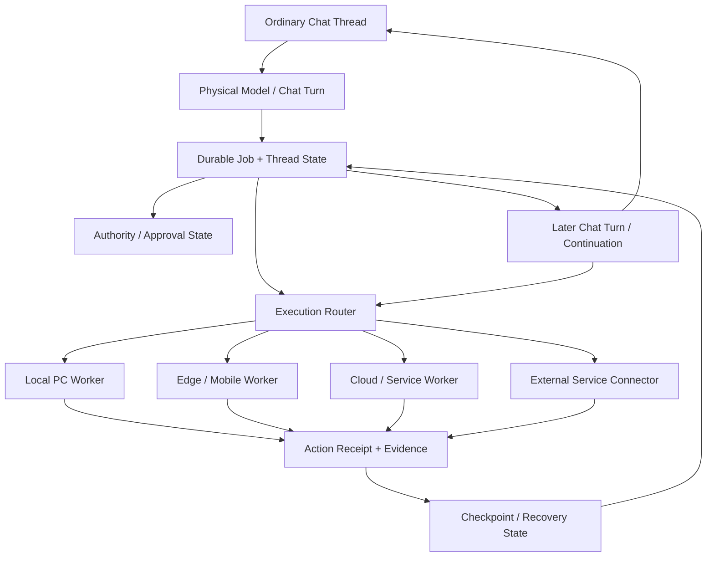

# AgentLink Architecture Overview

This document intentionally describes architecture at a **conceptual** level. It excludes production endpoints, credentials, internal hostnames, private network topology, and sensitive authorization implementation.

AgentLink's root architecture starts from an ordinary chat thread but refuses to make one physical model turn the lifetime of the job. Conversational context is useful reasoning state; durable operational state is what allows the work itself to survive.

## Chat-native execution model

A physical turn may end while the durable job remains active. A later continuation should load operational truth from durable state, not infer everything again from conversational memory.

## Two kinds of state

### Conversational / reasoning state

Useful for:

- understanding the user's current instruction
- planning
- deciding what to inspect next
- explaining results

It may be lost, summarized, truncated, moved to another thread, or replaced by a later model turn.

### Durable operational state

Used for facts that must survive those boundaries:

- stable job / thread identity
- objective and bounded scope
- completed and pending work
- current or previous worker ownership
- checkpoints
- effect receipts
- uncertainty / reconciliation state
- approval / authority state
- evidence needed for resume or audit

The architecture treats this durable layer as the source of truth for cross-turn execution.

## Core ideas

### 1. Durable job identity

Long-running work should have a stable identity that survives individual chat turns, process restarts, route changes, device changes, or worker changes.

A durable job can reference:

- objective
- current state
- completed actions
- pending actions
- approval / authority state
- worker capability needs
- ownership / lease state
- checkpoints and receipts

### 2. Physical turn boundaries are normal

A model response ending is not automatically a job completion event.

A continuation can conceptually:

1. load the durable job
2. inspect the latest valid checkpoint and receipts
3. claim or resume bounded ownership
4. continue pending work
5. record new evidence
6. return control to chat while the job identity remains durable

This is the contract illustrated by the public [Chat Long-Turn Continuity Demo](./demos/chat-long-turn-continuity/).

### 3. Action receipts

Execution should produce receipts that make it possible to answer questions such as:

- Was an action attempted?
- Did it complete?
- Which worker performed it?
- What state changed?
- Is retry safe?
- Did an effect happen even if the originating turn disappeared before it could mark the step complete?

Receipts are especially important when external side effects may not be safely repeatable.

### 4. Capability-aware routing

Workers have different capabilities, trust levels, latency, cost, and availability. AgentLink treats worker choice as an execution-layer problem rather than assuming one machine, one route, or one provider is always available.

A later physical turn does not need to use the same worker if durable ownership and authority permit a safe handoff.

### 5. Recoverable execution

The platform explores recovery rules that distinguish between:

- safe replay
- unsafe replay
- already completed work
- uncertain completion
- deliberately abstained work
- work that requires renewed human approval

A timeout, process loss, or missing acknowledgement is evidence of interruption, not proof that an external effect failed.

### 6. Authority boundaries

Long-running execution should not imply unlimited authority. Sensitive operations can require explicit approval or narrower scopes, and authority may need to survive, narrow, expire, or revoke independently of conversational context.

Conceptually, authority can include:

- capability scope
- expiration
- revocation
- resource scope
- action class
- human approval requirements

### 7. Worker handoff and parallel coordination

Multiple workers can increase throughput or allow continuation when one route disappears, but they create risks such as:

- duplicate work
- stale assumptions
- conflicting writes
- unclear ownership

AgentLink explores resource-scoped ownership, leases, receipts, checkpoints, and conflict controls so a later worker can continue pending work without replaying completed work.

## Design principles

**Chat is the human control surface; durable state is the operational truth.**

**Model intelligence and execution reliability are different layers.**

**A physical turn ending is not the same event as a job ending.**

AgentLink aims to remain compatible with multiple model providers and agent frameworks while specializing in persistent, controlled execution that can outlive a single response.

## Public proof path

The current public surfaces intentionally expose contracts rather than production internals:

- [Chat Long-Turn Continuity Demo](./demos/chat-long-turn-continuity/) — cross-turn/process resume
- [Receipt Replay Simulator](./demos/receipt-replay-simulator/) — conservative effect recovery
- [Worker Lease Recovery](./demos/worker-lease-recovery/) — worker ownership / recovery concept

The production core remains private.

## Security note

This architecture overview omits implementation details that could materially increase attack surface. See [SECURITY.md](./SECURITY.md).
