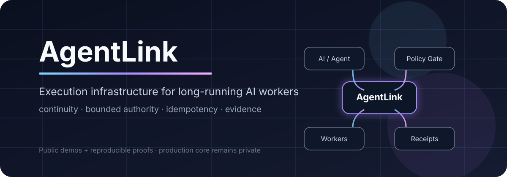
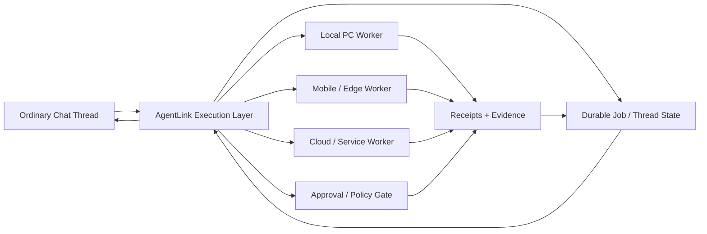

# AgentLink



[](https://github.com/paper-daemon/AgentLink/actions/workflows/full-python-suite.yml)

**Turn ordinary chat sessions into persistent, long-running AI agents that can keep working across turns, interruptions, devices, and tools.**

AgentLink is built around a chat-native idea: the user should be able to start from a normal ChatGPT-style conversation and let that same chat become an execution surface for a real AI agent. Instead of treating each answer or physical turn as the end of the job, AgentLink aims to preserve durable state, resume work, use connected devices and services, and continue useful execution for long periods.

The reliability machinery below exists to support that goal. Checkpoints, receipts, bounded authority, recovery, worker coordination, and idempotency are not the end product by themselves; they are the infrastructure needed to make **long-turn agent behavior inside ordinary chat slots** practical.

> This public repository is a technical showcase and evidence surface. The production core is private and is **not** published here.

## Core goal: chat-native agent execution

The root problem AgentLink is trying to solve is not simply “make a safer retry system.” It is broader:

- start from an ordinary chat thread rather than a separate agent dashboard
- let the chat act as an AI-agent control and execution slot
- keep useful work moving beyond a single physical model turn
- resume after turn limits, connection loss, browser loss, process restarts, or device changes
- preserve job state and evidence outside fragile conversational context
- let the agent use real tools, browsers, devices, services, and worker lanes
- avoid repeating external side effects when continuity breaks
- keep authority explicit and bounded while the agent runs for longer periods

The target experience is closer to: **“I asked in chat, and the agent keeps working until the job is actually done.”**

## Try one reliability primitive in 30 seconds

The independently MIT-licensed [Receipt Replay Simulator](./demos/receipt-replay-simulator/) demonstrates one small primitive needed by that larger chat-native agent model: **an interruption is not proof that an external action failed**.

```bash
git clone https://github.com/paper-daemon/AgentLink.git
cd AgentLink/demos/receipt-replay-simulator
python3 demo.py
python3 -m unittest -v
```

No external services, credentials, or third-party Python packages are required.

If chat-native long-running agents, durable execution, idempotent tool use, or recovery after interrupted side effects are problems you care about, **star the repository** to follow the public experiments and releases. Contributions and failure cases are also welcome on the explicitly licensed public surfaces.

### Public milestone

- **[Receipt Replay Simulator v0.1.0](https://github.com/paper-daemon/AgentLink/releases/tag/receipt-replay-simulator-v0.1.0)** is the first scoped public release.
- An external contributor fork produced **[PR #20](https://github.com/paper-daemon/AgentLink/pull/20)**, which was validated and merged into `main`.
- More narrowly scoped work is available through the [`good first issue`](https://github.com/paper-daemon/AgentLink/issues?q=is%3Aissue%20state%3Aopen%20label%3A%22good%20first%20issue%22) queue.

## Why AgentLink exists

Models are increasingly capable planners and tool users, but ordinary chat sessions are still shaped around short-lived turns. Real operational work may take hours or days and crosses sessions, devices, services, browser state, approvals, network failures, worker handoffs, and model-turn boundaries.

AgentLink tries to bridge that mismatch. The chat remains the human-facing control surface while durable execution state lives outside any one model response or browser tab.

AgentLink focuses on five properties:

- **continuity** — work can resume from durable state instead of one chat turn or one conversation URL
- **bounded authority** — workers operate inside explicit capabilities and human gates
- **idempotency** — uncertain outcomes are reconciled instead of blindly replayed
- **coordination** — multiple workers can own separate lanes without duplicating work
- **evidence** — important actions leave receipts, checkpoints, tests or other verifiable state

## Architecture



The goal is not to replace foundation models or chat products. The goal is to make an ordinary chat slot capable of coordinating work that survives beyond one response.

## Public proof surfaces

The public repository contains deliberately bounded demonstrations, documentation and case studies rather than the production runtime.

- **[Receipt Replay Simulator](./demos/receipt-replay-simulator/)** — MIT-licensed OSS demo with executable tests, conservative recovery, pre-attempt guards, and an external contribution path
- **[Site Surface Doctor proof](./PUBLIC_PROOF_SITE_SURFACE_DOCTOR.md)** — CI-backed public-surface checks
- **[RAG Fleet Harness MVP case study](./CASE_STUDY_RAG_FLEET.md)** — isolated agent configuration, routing, validation, health reporting and automated tests
- **[Architecture notes](./ARCHITECTURE.md)** — execution-layer design and boundaries
- **[Technical proofs](./TECHNICAL_PROOFS.md)** — evidence for selected implementation claims
- **[Security boundary](./SECURITY.md)** — what is intentionally not exposed

Public claims should be backed by implementation evidence, tests, receipts, or a reproducible demo. A tiny tool that can be regenerated from a few prompts is not treated as headline proof merely because it exists.

### Open-source contribution surface

The [Receipt Replay Simulator](./demos/receipt-replay-simulator/) is independently released under the MIT License. External testing, bug reports, documentation improvements, and narrow code contributions are welcome. Start with its [contribution guide](./demos/receipt-replay-simulator/CONTRIBUTING.md) or pick up a [`good first issue`](https://github.com/paper-daemon/AgentLink/issues?q=is%3Aissue%20state%3Aopen%20label%3A%22good%20first%20issue%22).

The private production core remains intentionally unpublished; contribution invitations apply only to explicitly licensed public surfaces.

## Current engineering directions

The private implementation currently spans areas such as:

- durable chat-thread and job state
- long-turn continuation and resume
- local / remote worker execution
- Android, PC and gateway integration
- execution receipts and replay prevention
- worker leases and stale-owner recovery
- multi-route execution and fallback
- permission / approval boundaries
- parallel work lanes and conflict control
- browser and service recovery
- long-running Company OS experiments inside chat-driven operation

These are active engineering directions, not promises that every surface is production-ready.

## Reliability model

A central rule is simple: **unknown is not the same as failed**.

When an external action is interrupted, recovery should prefer:

1. read back durable state or a receipt
2. determine whether the side effect already happened
3. resume from the latest valid checkpoint
4. retry only when duplicate execution is safe or ruled out

This is why AgentLink treats checkpoints, idempotency keys, effect receipts and human gates as first-class execution state rather than logging afterthoughts.

## AI-native Company OS thesis

AgentLink is also used as an internal operating substrate for AI workers controlled from chat. A Company OS lane can own durable work, hand bounded tasks to child workers, collect evidence, survive thread or browser loss, and continue from state instead of relying on one model turn or one conversation URL.

Human operators remain responsible for legal accountability, governance, sensitive approvals, identity-bound actions and other authority that should not be delegated.

## Public release bar

Not every internal helper needs its own public repository. Public work should earn its place by showing at least one of these:

- real multi-system integration
- continued use in an actual operating workflow
- non-trivial failure handling or recovery
- meaningful test / CI evidence
- a reproducible system-level demo
- implementation depth that is not reasonably replaced by a few generic model prompts

Small experiments can be folded into a larger project, kept internal, or used as fixtures instead of being promoted as standalone work.

## Paid engineering

Paid work follows the same rule. We do **not** sell generic prompt output, planning templates, one-file cleanup, or review-only documents as premium engineering.

Current fixed scopes in **[SERVICES.md](./SERVICES.md)** are hands-on:

- reproduce and repair an existing automation failure
- harden an existing Agent / RAG flow and test failure paths
- deploy one real automation workflow into the target environment and verify it

The value is in changing and validating the actual system, not in producing a longer answer than a general-purpose AI subscription can.

There are currently no paid downloadable template packs. See **[DIGITAL_PRODUCTS.md](./DIGITAL_PRODUCTS.md)**.

## R&D themes

Current questions include:

- how far useful agent work can continue from an ordinary chat control surface
- how to resume long-running execution across physical model turns without losing operational truth
- how to fail over without duplicating external side effects
- how authority should survive, narrow, expire or revoke across worker migration
- how parallel workers coordinate without globally serializing useful work
- how to keep durable state compact enough for long-horizon operation
- how to separate model reasoning from durable operational truth

See [ARCHITECTURE.md](./ARCHITECTURE.md), [TECHNICAL_PROOFS.md](./TECHNICAL_PROOFS.md) and [ROADMAP.md](./ROADMAP.md).

## What is intentionally not public

The public repository does **not** contain:

- production AgentLink source code
- credentials, tokens, secrets or private URLs
- internal host / network details
- detailed authorization internals that would materially increase attack surface
- private customer or user data
- internal operational state and sensitive runbooks

See [SECURITY.md](./SECURITY.md).

## Current stage

AgentLink is an early-stage platform and R&D project. Current priorities include chat-native long-turn execution, continuity across model turns and devices, reliability measurement, security hardening, real-environment automation, and failure recovery.

## Support and collaboration

For a non-confidential engineering inquiry, use [SERVICES.md](./SERVICES.md) or the public contact surfaces on https://paper-daemon.github.io/.

Do not post credentials, API keys, personal data, proprietary datasets or other confidential information in a public issue.

## Repository status

This repository is a **public showcase and documentation repository**, not the production AgentLink source tree.

No license is granted to unpublished AgentLink core code. Public repository content remains subject to [NOTICE.md](./NOTICE.md).