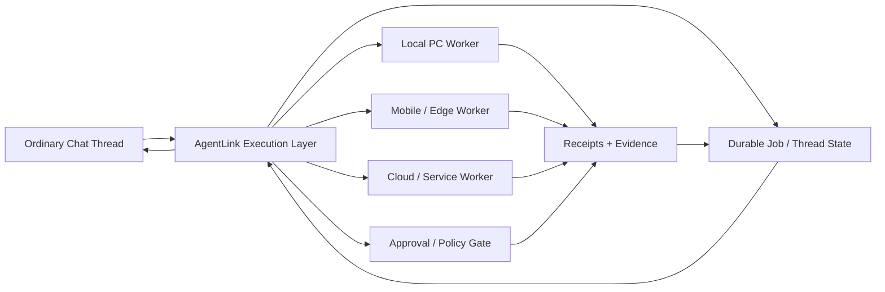

# AgentLink


[](https://github.com/paper-daemon/AgentLink/actions/workflows/full-python-suite.yml)
[](https://github.com/paper-daemon/AgentLink/actions/workflows/chat-long-turn-continuity.yml)

**Turn ordinary chat sessions into persistent, long-running AI agents.**

AgentLink is built around one chat-native idea: a normal chat thread should be able to become an execution slot for a real AI agent, so useful work can continue across physical model turns, interruptions, devices, tools, and worker handoffs instead of dying with one response.

> Target experience: **“I asked in chat, and the agent keeps working until the job is actually done.”**

The production AgentLink core is private. This public repository contains bounded demos, tests, architecture notes, and reproducible proof surfaces for selected execution contracts.

## Try the flagship continuity demo

**[▶ Try the no-install browser demo](https://paper-daemon.github.io/agentlink-continuity/)** — start a chat job, interrupt it after an effect, reload the page, and resume from durable browser state without replaying the effect.

The independently MIT-licensed **[Chat Long-Turn Continuity Demo](./demos/chat-long-turn-continuity/)** provides the reproducible Python version:

```bash
git clone https://github.com/paper-daemon/AgentLink.git
cd AgentLink/demos/chat-long-turn-continuity
python3 run_demo.py
```

It launches separate fresh Python processes for multiple `chat-turn-*` continuations. One turn is deliberately interrupted after an external-effect receipt is written but before the step is marked complete. A later continuation loads the same durable state, sees the receipt, and finishes the job **without replaying the effect**.

No credentials, external services, or third-party Python packages are required.

**[Chat Long-Turn Continuity Demo v0.1.0](https://github.com/paper-daemon/AgentLink/releases/tag/chat-long-turn-continuity-v0.1.0)** is now released.

If chat-native long-running agents are a problem you care about, **star the repository** to follow the public experiments and releases. Failure cases and narrowly scoped contributions are welcome on explicitly licensed public surfaces.

## What AgentLink is trying to make possible

- start from an ordinary chat thread instead of a separate agent dashboard
- keep useful work moving beyond one physical model turn
- persist job/thread state outside fragile conversational context
- resume after turn limits, connection loss, browser loss, process restarts, or device changes
- let later turns or workers continue from the latest valid checkpoint
- use real tools, browsers, devices, services, and worker lanes
- avoid repeating external side effects when continuity breaks
- keep authority explicit and bounded while execution runs for longer periods
- leave receipts and evidence that make recovery inspectable

The reliability machinery exists to support this larger goal. Checkpoints, receipts, worker coordination, bounded authority, and idempotency are infrastructure for **chat-native long-turn agent execution**.

## Architecture



The goal is not to replace foundation models or chat products. The goal is to make an ordinary chat slot capable of coordinating work that survives beyond one response.

## Public proof surfaces

- **[Chat Long-Turn Continuity Demo](./demos/chat-long-turn-continuity/)** — flagship MIT demo for durable continuation across fresh physical turns/processes
- **[Receipt Replay Simulator](./demos/receipt-replay-simulator/)** — MIT reliability primitive for conservative recovery after interrupted side effects
- **[Receipt Replay Simulator v0.1.0](https://github.com/paper-daemon/AgentLink/releases/tag/receipt-replay-simulator-v0.1.0)** — first scoped public release
- **[Worker Lease Recovery](./demos/worker-lease-recovery/)** — small handoff/recovery proof
- **[RAG Fleet Harness case study](./CASE_STUDY_RAG_FLEET.md)** — isolated agent routing, validation, health and test evidence
- **[Architecture notes](./ARCHITECTURE.md)** — execution-layer design and boundaries
- **[Technical proofs](./TECHNICAL_PROOFS.md)** — evidence for selected implementation claims
- **[Security boundary](./SECURITY.md)** — what is intentionally not exposed

Public claims should be backed by implementation evidence, tests, receipts, or a reproducible demo.

## Related public tools

A few independently published OSS tools explore reliability problems that also matter to long-running AgentLink execution:

- **[Idempotency Receipt Ledger](https://github.com/paper-daemon/idempotency-receipt-ledger)** — durable `EXECUTE / SKIP / CONFLICT` decisions around external side effects
- **[Retry Budget Lab](https://github.com/paper-daemon/retry-budget-lab)** — estimate request amplification, worst-case delay, and retry pressure before deploying a retry policy

These repositories are separate MIT-licensed projects. They are useful public experiments around the same execution-reliability space and do not publish or mirror the private AgentLink production core.

## Reliability model

A central rule is: **unknown is not the same as failed**.

When continuity breaks around an external action, recovery should prefer:

1. read back durable state or a receipt
2. determine whether the side effect already happened
3. resume from the latest valid checkpoint
4. retry only when duplicate execution is safe or ruled out

This is why AgentLink treats checkpoints, effect receipts, idempotency, worker ownership, and human gates as first-class execution state rather than logging afterthoughts.

## OSS activity

The public repo is early-stage but already has real external participation:

- external contributor fork → **[PR #20](https://github.com/paper-daemon/AgentLink/pull/20)** → validation → merge
- flagship continuity implementation → **[PR #25](https://github.com/paper-daemon/AgentLink/pull/25)** → Full Python suite success → squash merge
- newcomer tasks are available through **[`good first issue`](https://github.com/paper-daemon/AgentLink/issues?q=is%3Aissue%20state%3Aopen%20label%3A%22good%20first%20issue%22)**, including worker-handoff coverage for the flagship demo

See **[CONTRIBUTING.md](./CONTRIBUTING.md)** for the public/private license boundary and contribution rules.

## Current engineering directions

The private implementation currently spans areas such as durable chat/job state, long-turn continuation, local and remote worker execution, Android/PC/gateway integration, receipts and replay prevention, worker leases, multi-route fallback, approval boundaries, parallel lanes, browser/service recovery, and long-running Company OS experiments controlled from chat.

These are active engineering directions, not a claim that every surface is production-ready.

## Public/private boundary

This repository intentionally does **not** publish:

- production AgentLink source code
- credentials, tokens, secrets, or private URLs
- internal host/network details
- private customer or user data
- sensitive operational state or runbooks

The independently licensed public demos state their own licenses in their directories. **No repository-wide license is granted to the unpublished AgentLink production core.** See [NOTICE.md](./NOTICE.md) and [SECURITY.md](./SECURITY.md).

## More

- [Roadmap](./ROADMAP.md)
- [Architecture](./ARCHITECTURE.md)
- [Technical proofs](./TECHNICAL_PROOFS.md)
- [Services](./SERVICES.md)
- [Share kit](./SHARE.md)
- Public home: https://paper-daemon.github.io/
